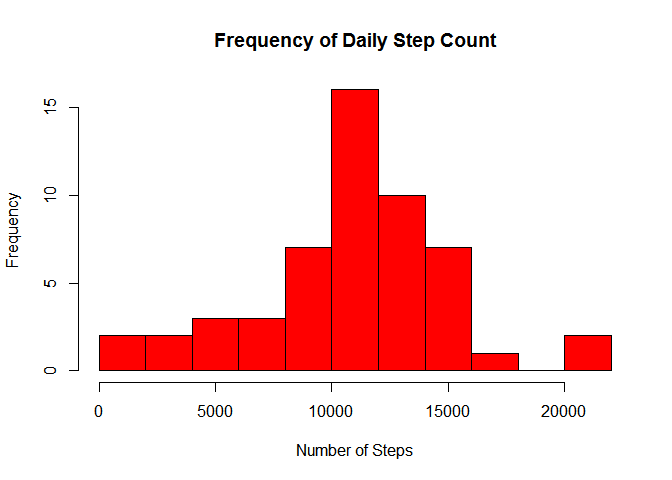
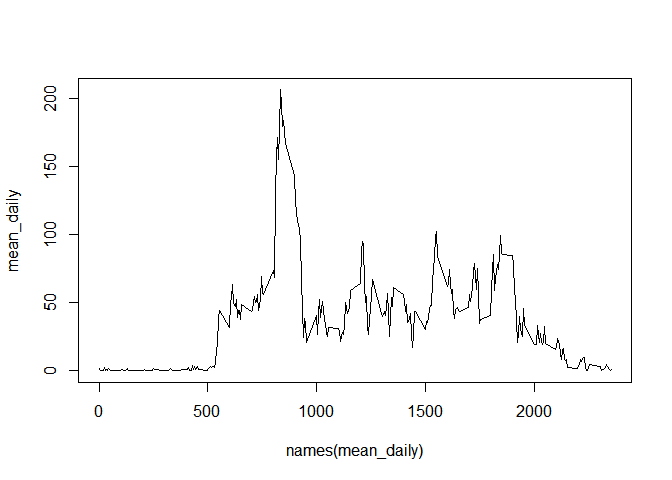
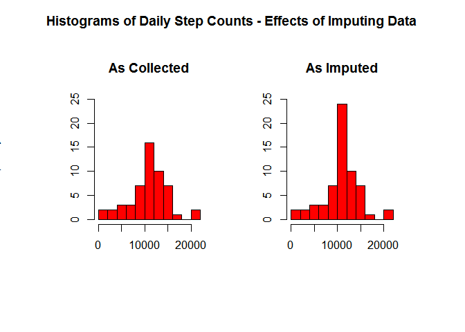

# Reproducible Research: Peer Assessment 1


## Loading and preprocessing the data


```r
fileUrl <- "https://d396qusza40orc.cloudfront.net/repdata%2Fdata%2Factivity.zip"
temp <- "data/temp.zip"

if (!file.exists(temp)) {
        download.file(url = fileUrl, destfile = temp)
        date_Downloaded <- date()
}

dfNames <- unzip(temp, list = FALSE, exdir = "data")

if (!exists("AMD")) {
        AMD <- as_tibble(read.csv(dfNames[1]))
}
```
### Process/transform the data into a format suitable for analysis

```r
        AMD$date <- as.Date(AMD$date)

str(AMD)
```

```
## Classes 'tbl_df', 'tbl' and 'data.frame':	17568 obs. of  3 variables:
##  $ steps   : int  NA NA NA NA NA NA NA NA NA NA ...
##  $ date    : Date, format: "2012-10-01" "2012-10-01" ...
##  $ interval: int  0 5 10 15 20 25 30 35 40 45 ...
```

```r
head(AMD)
```

```
## # A tibble: 6 × 3
##   steps       date interval
##   <int>     <date>    <int>
## 1    NA 2012-10-01        0
## 2    NA 2012-10-01        5
## 3    NA 2012-10-01       10
## 4    NA 2012-10-01       15
## 5    NA 2012-10-01       20
## 6    NA 2012-10-01       25
```

## What is mean total number of steps taken per day?

### Total number of steps per day

```r
        steps.tot <- with(AMD, tapply(steps, INDEX = date, FUN = sum))
        head(steps.tot)
```

```
## 2012-10-01 2012-10-02 2012-10-03 2012-10-04 2012-10-05 2012-10-06 
##         NA        126      11352      12116      13294      15420
```
        
### Histogram of daily steps

```r
        hist(steps.tot,
            col = "red",
            breaks = 10,
            main = "Frequency of Daily Step Count", 
            xlab = "Number of Steps", 
            ylab = "Frequency"
            )
```

<!-- -->

### Calculate and report the **mean** and **median** total number of steps taken per day


```r
       writeLines(
               paste("Mean total steps per day:", 
                     round(mean(steps.tot, na.rm = TRUE), 2),"\n",
                     "Median total steps per day:", 
                     round(median(steps.tot, na.rm = TRUE),2)
                     )
       )
```

```
## Mean total steps per day: 10766.19 
##  Median total steps per day: 10765
```

## What is the average daily activity pattern?
### The time series plot

```r
   mean_daily <- with(AMD, tapply(steps, INDEX = interval, FUN = mean, na.rm = TRUE))
   plot(names(mean_daily),mean_daily, type = "l")
```

<!-- -->

## Imputing missing values  

### Missing values in the dataset 

```r
 paste("There are",sum(is.na(AMD)),"intervals with missing step counts.")
```

```
## [1] "There are 2304 intervals with missing step counts."
```
### Devise a strategy for filling in all missing values.

I will use the mean step count for a given five-minute interval. This should not change the mean daily step count.

@. Create a new dataset that is equal to the original dataset but with the missing data filled in.


```r
# look at the values of AMD for interval and steps where AMD is.na
# if AMD[i, steps] == NA, AMD1$steps <- mean_daily$steps for given interval  
AMD1 <- AMD
AMD1$interval <- as.character(AMD1$interval)
        for (i in seq_along(AMD1$steps)) {
                t <- AMD1$interval[i]
                   if (is.na(AMD1$steps[i])) {
                       #get the mean steps for the given interval
                        AMD1$steps[i] <- mean_daily[t]
                }
                else (AMD1$steps[i] <- AMD1$steps[i])
        }
```
### Histogram of the total number of steps taken each day 
Plotting a histogram of the step counts shows that imputing data to the missing intervals increases the frequency of daily step-counts between 10,000 and 12,000 while having minimal effects on the frequency of higher or lower step counts. 


```r
 steps.tot.imp <- with(AMD1, tapply(steps, INDEX = date, FUN = sum))
        
        par(mfrow = c(1,2),
            oma = c(3,3,3,3))
        hist(steps.tot, 
            col = "red", 
            main = "As Collected", 
            breaks = 10,
            ylim = c(0,25),
            xlim = c(0,22000),
            xlab = "",
            ylab = ""
            )
        hist(steps.tot.imp,
            col = "red", 
            main = "As Imputed", 
            breaks = 10,
            ylim = c(0,25),
            xlim = c(0,22000),
            xlab = "",
            ylab = ""
            )
        title(main = "Histograms of Daily Step Counts - Effects of Imputing Data", 
              xlab = "Step Count",
              ylab = "Frequency",
              outer = TRUE
              )
```

<!-- -->

### Impact of imputations on whole: 
Calculate and report the **mean** and **median** total number of steps taken per day. Do these values differ from the estimates from the first part of the assignment? What is the impact of imputing missing data on the estimates of the total daily number of steps?


```r
imputed.calcs <- data.frame(
        "mean (missing)" = mean(steps.tot, na.rm = TRUE),
        " | median (missing)" = median(steps.tot, na.rm = TRUE),
        " | mean (imputed)" = mean(steps.tot.imp),
        " | median (imputed)" = median(steps.tot.imp), check.names = FALSE
)

print(imputed.calcs)
```

```
##   mean (missing)  | median (missing)  | mean (imputed)  | median (imputed)
## 1       10766.19               10765          10766.19            10766.19
```

## Are there differences in activity patterns between weekdays and weekends? 

@. Create a new factor variable in the dataset with two levels -- "weekday" and "weekend" indicating whether a given date is a weekday or weekend day.


```r
#character vectors for weekday and weekend
weekday <- c("Mon", "Tue", "Wed", "Thu", "Fri")
weekend <- c("Sat", "Sun")

#create wk() function to return weekday or weekend
#
wk <- function(date) {
        if (date %in% weekday) {
                return("weekday")
        }
        if (date %in% weekend) {
                return("weekend")
        }
}

#add the wd column which temporarily holds the actual weekday
AMD.day <- mutate(AMD1, wd = (weekdays(date, abbreviate = TRUE)), interval = as.numeric(interval))

#loop through and perform wk() on each observation in AMD.day
# question for a later date - could I do this all in the step above?

for (i in seq_along(AMD.day$wd)) {
        AMD.day$wd[i] <- wk(AMD.day$wd[i])
}
```
